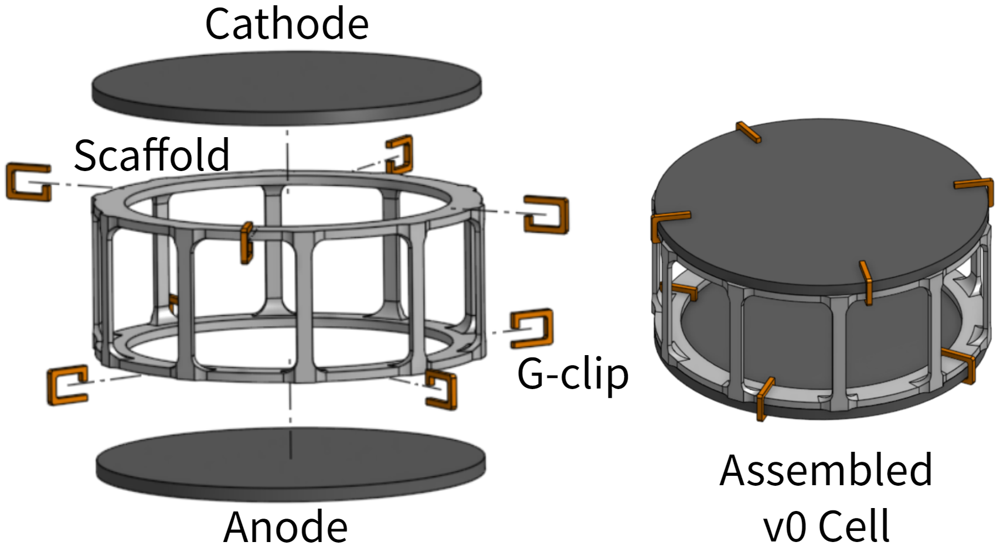

# Soil-Powered Computing:🌱   The Engineer's Guide to _Practical_ SMFC Design⚙️
This is the official repository for practical soil-powered computing.

  

## Project Abstract
Human-caused climate degradation and the explosion of electronic waste have pushed the computing community to explore fundamental alternatives to the current battery-powered, over-provisioned ubiquitous computing devices that need constant replacement and recharging. Soil Microbial Fuel Cells (SMFCs) offer promise as a renewable energy source that is biocompatible and viable in difficult environments where traditional batteries and solar panels fall short. However, SMFC development is in its infancy, and challenges like robustness to environmental factors and low power output stymie efforts to implement real-world applications in terrestrial environments. This work details a 2-year iterative process that uncovers barriers to practical SMFC design for powering electronics, which we address through a mechanistic understanding of SMFC theory from the literature. We present nine months of deployment data gathered from four SMFC experiments exploring cell geometries, resulting in an improved SMFC that generates power across a wider soil moisture range. From these experiments, we extracted key lessons and a testing framework, assessed SMFC’s field performance, contextualized improvements with emerging and existing computing systems, and demonstrated the improved SMFC powering a wireless sensor for soil moisture and touch sensing. We contribute our data, methodology, and designs to establish the foundation for a sustainable, soil-powered future.

## 3D-Printable Soil Microbial Fuel Cells (SMFC)
The `.stl` files for the baseline v0 SMFC and the improved v3.1 SMFC can be found in the `CAD` folder.

Baseline v0 SMFC           |  Improved v3.1 SMFC
:-------------------------:|:-------------------------:
  |  

## Trace-based Computing Runtime Simulation
The trace-based runtime simulation uses real-life SMFC power traces and the user's desired computing systems' datasheet values to estimate the number of possible computing operations one can achieve in a day given the SMFC's energy level. See `Runtime_Simulation/models.py` for how the model is constructed, `Runtime_Simulation/SMFC.py` and the `.csv` files in `Data/design_iterations` for how to format the input SMFC data correctly for the program, `Runtime_Simulation/main.py` to run the simulation and generate the graphs, and `Runtime_Simulation/visualizations.py` to tune the visualization graphs (see below).

  

  

  

## SMFC Design Iteration Data
The data collected from our 2-year-long iterative design process is in `Data/design_iterations`. It includes the data from our v0, v1, v2, and v3 prototypes, and we also included the data from our outdoor deployment of the v3.1 cell in `Data/outdoor_deployment.csv`.

  

